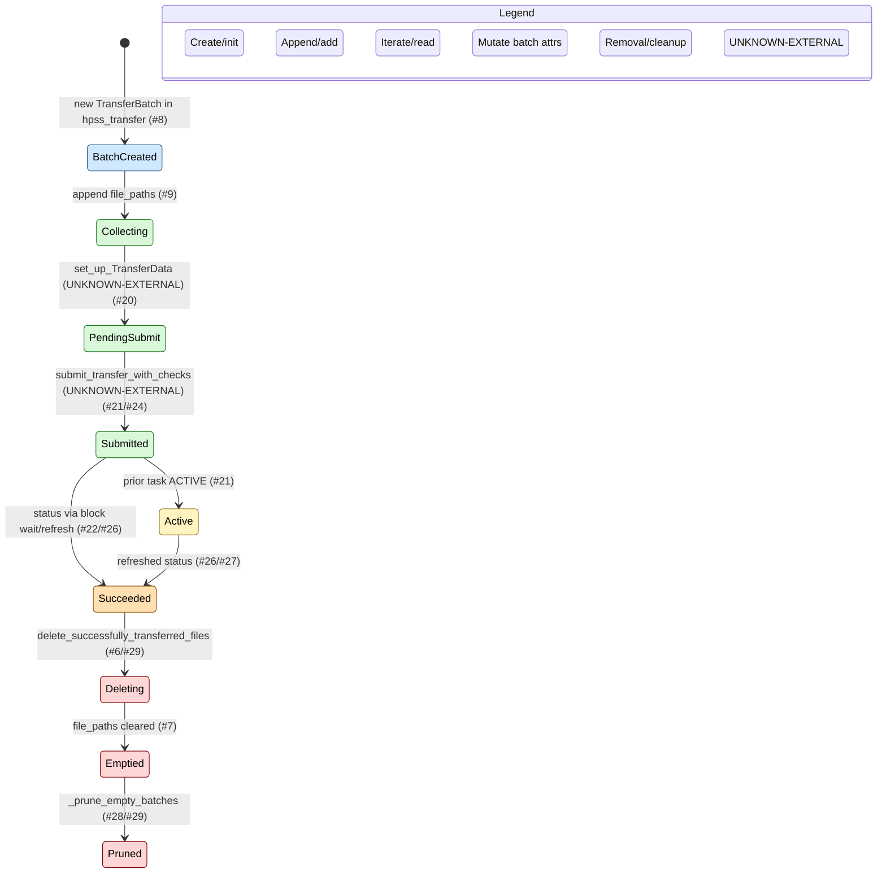

# TransferBatch Flow (scoped)

Scope: tests/integration/bash_tests/run_from_any/test_globus_tar_deletion.bash, zstash/create.py, zstash/globus.py, zstash/hpss.py, zstash/hpss_utils.py, zstash/transfer_tracking.py, zstash/update.py. Any dependency outside these files is marked UNKNOWN-EXTERNAL.

Time semantics: single `zstash create`/`zstash update` invocation; tars are built sequentially, transfers may be blocking or non-blocking; final cleanup runs in `globus_finalize`.

## Mermaid A: TransferBatch Lifecycle



## Mermaid B: transfer_manager.batches Evolution

```mermaid
flowchart TD
  classDef create fill:#cfe8ff,stroke:#1f4e79,color:#000;
  classDef add fill:#d9f7d9,stroke:#1f7a1f,color:#000;
  classDef read fill:#fff3bf,stroke:#7a5c00,color:#000;
  classDef mutate fill:#ffe0b2,stroke:#8a4b00,color:#000;
  classDef remove fill:#ffd6d6,stroke:#7a0000,color:#000;
  classDef external fill:#e0e0e0,stroke:#666,color:#000;

  Start([TransferManager.__init__ sets batches=[]]):::create
  Check{No batches or last task_id set?}:::read
  Start --> Check
  Check -->|yes| AppendBatch([TransferBatch() appended; is_globus set]):::create
  Check -->|no| UseOpen([Reuse open batch]):::read
  AppendBatch --> Collect([file_paths append in hpss_transfer]):::add
  UseOpen --> Collect
  Collect --> Submit([globus_transfer sets task_id/status UNKNOWN]):::mutate
  Collect --> PendingFinal([transfer_data built / pending submit]):::add
  PendingFinal --> Submit
  Submit --> Status([task_status refreshed via get_task/block wait]):::mutate
  Status --> Cleanup([delete_successfully_transferred_files clears file_paths]):::remove
  Cleanup --> Prune([_prune_empty_batches filters empties]):::remove
  Submit --> Finalize([globus_finalize collects, waits, prunes]):::remove
  Collect --> Finalize

  subgraph Legend
    L1(Create/init):::create
    L2(Append/add):::add
    L3(Iterate/read):::read
    L4(Mutate batch object):::mutate
    L5(Removal/cleanup):::remove
    L6(UNKNOWN-EXTERNAL):::external
  end
```

## Operations Ledger (exhaustive)

| File | Function/Method | Line range | Operation type | Code excerpt | Notes |
| --- | --- | --- | --- | --- | --- |
| zstash/transfer_tracking.py | TransferBatch.__init__ | 24-29 | INIT | `self.file_paths = []` / `self.task_id = None` | Initialize batch fields. |
| zstash/transfer_tracking.py | TransferBatch.delete_files | 31-36 | ITERATE | `for src_path in self.file_paths:` / `os.remove(src_path)` | Reads file_paths to delete local files. |
| zstash/transfer_tracking.py | TransferManager.__init__ | 40-46 | INIT | `self.batches: List[TransferBatch] = []` | Initialize batches container. |
| zstash/transfer_tracking.py | get_most_recent_transfer | 48-51 | READ | `return self.batches[-1] if self.batches else None` | Tail read of batches. |
| zstash/transfer_tracking.py | delete_successfully_transferred_files | 56-58 | FILTER_SORT | `self.batches = [batch for batch in self.batches if batch.file_paths]` | Reassigns to non-empty batches. |
| zstash/transfer_tracking.py | delete_successfully_transferred_files | 59-84 | MUTATE_BATCH_OBJECT | Polls pending Globus batch, sets `batch_to_poll.task_status`. | Uses transfer_client when present. |
| zstash/transfer_tracking.py | delete_successfully_transferred_files | 90-98 | MUTATE_BATCH_OBJECT | On succeeded/non-Globus: `batch.delete_files()` then `batch.file_paths = []`. | Marks processed. |
| zstash/hpss.py | hpss_transfer | 25-27 | INIT | Create TransferManager if none provided. |
| zstash/hpss.py | hpss_transfer | 31-37 | APPEND | New TransferBatch created/appended when none or last submitted; sets `is_globus`. |
| zstash/hpss.py | hpss_transfer | 90-95 | APPEND | Append file_path to current `file_paths` when tracked. |
| zstash/hpss.py | hpss_transfer | 110-126 | READ | Ensure GlobusConfig, call `globus_transfer`, read most recent transfer status. |
| zstash/hpss.py | hpss_transfer | 142-145 | REMOVE | `transfer_manager.delete_successfully_transferred_files()` after put when not keep. |
| zstash/create.py | create | 56-63 | INIT | Initialize TransferManager; maybe set globus_config. |
| zstash/create.py | create | 92-107 | READ | Pass manager into create_database, hpss_put, globus_finalize. |
| zstash/create.py | create_database | 216-295 | READ | Pass manager into construct_tars. |
| zstash/update.py | update | 25-26 | INIT | Initialize TransferManager. |
| zstash/update.py | update | 34-49 | READ | Pass manager into hpss_put and globus_finalize. |
| zstash/update.py | update_database | 154-165 | INIT | Activate Globus + hpss_get with manager. |
| zstash/update.py | update_database | 284-295 | READ | Pass manager into construct_tars. |
| zstash/globus.py | globus_transfer | 106-115 | READ | Get most recent batch; set_up_TransferData (UNKNOWN-EXTERNAL). |
| zstash/globus.py | globus_transfer | 119-157 | MUTATE_BATCH_OBJECT | Refresh `mrt.task_status` via `get_task`. |
| zstash/globus.py | globus_transfer | 183-189 | MUTATE_BATCH_OBJECT | Set `task_id`, `task_status`, clear `transfer_data` on current batch. |
| zstash/globus.py | globus_transfer | 207-223 | MUTATE_BATCH_OBJECT | Blocking path sets `new_mrt.task_status` via globus_block_wait. |
| zstash/globus.py | _submit_pending_transfer_data | 347-372 | MUTATE_BATCH_OBJECT | Submit pending TransferData; best-effort set `transfer.task_id`. |
| zstash/globus.py | _collect_globus_task_ids | 389-430 | ITERATE | Iterate batches to build task_ids map for non-empty Globus batches. |
| zstash/globus.py | _refresh_batch_status | 442-448 | MUTATE_BATCH_OBJECT | Fetch task status; set `batch.task_status` when mapped. |
| zstash/globus.py | _wait_for_all_tasks | 465-477 | ITERATE | Iterate task_ids; wait and refresh statuses. |
| zstash/globus.py | _prune_empty_batches | 487-491 | FILTER_SORT | Reassign batches to those with `file_paths`. |
| zstash/globus.py | globus_finalize | 505-517 | REMOVE | Submit pending, collect ids, wait, delete, prune. |
| zstash/hpss_utils.py | TarWrapper.process_tar | 135-147 | READ | Calls hpss_put with transfer_manager. |
| zstash/hpss_utils.py | construct_tars | 313-325 | READ | Accepts optional transfer_manager. |
| zstash/hpss_utils.py | construct_tars (loop) | 406-417 | READ | Passes manager into tar processing. |

Notes:
- UNKNOWN-EXTERNAL: set_up_TransferData, submit_transfer_with_checks reside outside scoped files.
- No additional files were consulted beyond the scope list above.
